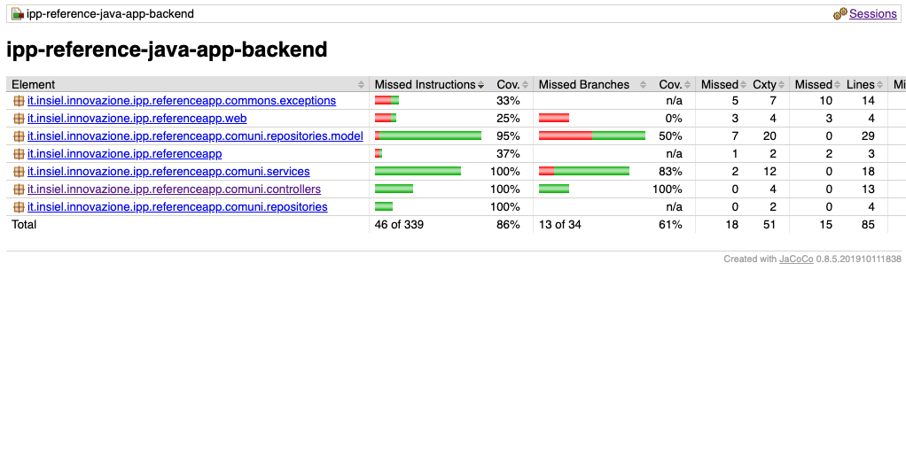

# IPP Reference App
Questa app nasce come strumento di validazione della toolchain Cloudbees nell'ambito del 
progetto [IPP - Ingegnerizzazione del Processo Produttivo](https://insiel.sharepoint.com/sites/cloudnative
).


## Setup
Per eseguire il progetto in locale è sufficiente clonare questo repository ed eseguire il comando:

```shell
./mvnw spring-boot:run
```

Tale operazione richiede come prerequisiti software già installati sulla macchina:

  - Java 11
  
## Esecuzione dei test
Per eseguire i test è sufficiente eseguire da linea di comando:

```shell
./mvnw test
```

Tra i vari test eseguiti durante l'esecuzione di tale comando si possono ritrovare i test
di unità usati per il coverage, 




e quelli d'integrazione realizzati con Cucumber.


## Generazione del site
Per generare il sito eseguire il seguente comando:

    mvnw clean install

    mvnw site
    
Aprire il file target/site/index.html

Per info su come creare un sito in maven consultare al link https://maven.apache.org/guides/mini/guide-site.html

Per lanciare il programma eseguire il file ReferenceApplication.java e accedere al sito http://localhost:8080

## Integration Test con Selenium
```shell
./mvnw verify -P selenium
```

## Troubleshooting
### Plugin
Per verificare i plugin e le fasi in cui si attivano i relativi goal, eseguire il comando:

```shell
./mvnw fr.jcgay.maven.plugins:buildplan-maven-plugin:list
```


### Exit code 127 in fase di esecuzione test con selenium
Il file `src/main/docker/docker-entrypoint.sh` è uno script linux. Come tale è sensibile
al tipo di ritorno a capo. Accertarsi di aver sempre impostato come carriage return di default
quello di linux. Per eseguire tale operazione, bisogna configurare git in modo opporturno con
il comando: 

```shell
git config --global core.autocrlf false
```

Inoltre, si consiglia di prestazione attenzione alla configurazione dell'IDE, che deve essere
impostato per lavorare con il carriage return in stile Linux.


### Rete e Proxy
La fase di build con Maven e l'esecuzione dei test funzionali (Selenium) necessitano di accesso internet. 

Nel caso sia necessario configuare un server PROXY, seguire i seguenti passi:

**Maven**

Nella shell di esecuzione Maven configurare la variabile ambientale MAVEN_OPTS
```shell
export MAVEN_OPTS="-Dhttp.proxyHost=proxy-bc.insiel.it -Dhttp.proxyPort=8046 -Dhttps.proxyHost=proxy-bc.insiel.it -Dhttps.proxyPort=8046"
```
**Selenium**

Selenium-side-runner richiede l'accesso alla risorsa pubblica npm registry.
Per configurare le variabili ambientali del container "runner" e' sufficiente scommentare la seguente sezione nel file pom.xml
```
<!--
<env>
  <HTTP_PROXY>http://proxy-bc.insiel.it:8046</HTTP_PROXY>
  <HTTPS_PROXY>http://proxy-bc.insiel.it:8046</HTTPS_PROXY>
</env>
-->
```
